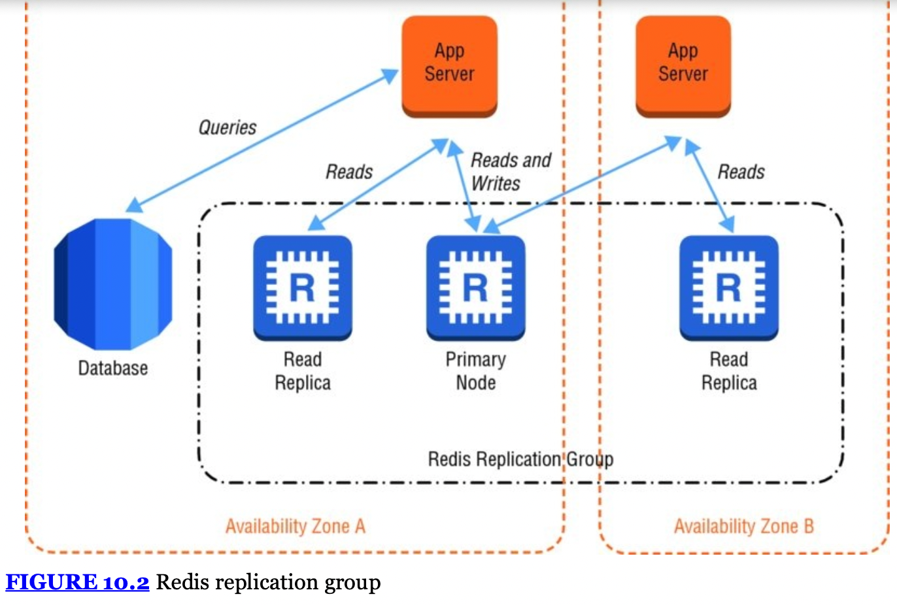

# Chapter 10 - Amazon Elasticache

- **Elasticache**
  : web service that simplifies the setup and management of distributed in-memory caching environments
  - speed up the deployment of cache clusters & reduce administration required for distributed cache clusters
  - _ElastiCache_ allows you to offload the heavy lifting of installation, patch management, and monitoring to AWS

- **Memcached**
  : provides a very simple interface that allows you to write and read objects into in-memory key/value data stores
  - *Elasticache* allows you to grow and shrink a cluster of _memcached_ nodes
  - can partition your cluster into shards
  - support parallelized operations for high throughput
  - deals with objects as _blobs_ that can be retreived via a _key_

- **Redis**
  - supports a rich set of data types likes strings, lists, and sets
  - supports the ability to persist the in-memory data onto disk
    - you can create snapshots that back up your data and then recover or replicate from the backups
  - support up to five read replicas to offload read requests
  - greater support to sort and rank data
  - can be used as a message broker

- **Nodes & Clusters**
  : each _Elasticache_ deployment consists of one or more _nodes_ in a cluster
  - single _Memcached_ deployment can contain up to 20 nodes
  - _Redis_ clusters are always made up of 1 node, however _multiple clusters_ can be grouped into a _Redis replication group_.
  - node types are derived from a subset of _EC2 instance types_
  - can chose to have a few large nodes or many small nodes in cluster
  - each node type comes with a preconfigured amount of memory
  - in the event that Amazon ElastiCache detects the failure of a node, it will provision a replacement and add it back to the cluster
    - database likely to experience increased workload

- **Memcached Auto Discovery**
  : simplifies your application code by no longer needing awareness of the infrastructure topology of the cache cluster in your application layer

- **Scaling**
  - **Horizontal Scaling**
    - _Memcached_
      : you can partition your data and scale horizontally to 20 nodes or more
      - with _auto discovery_ the application can automatically discover nodes added to the cluster
    - _Redis_
      : additional clusters can be created and grouped into a _Redis replication group_
      - only one node handling write requests
      - can have many nodes handling read requests
  - **Vertical Scaling**
    - have to spin up a new cluster and redirect traffic

- **Replication and Multi-AZ**
  : useful technique to provide rapid recovery in the event of node failure
  - no replication support for _Memcached_
  - replication group support for _Redis_

- **Multi-AZ Replication Groups**
  - increase availability and minimize the loss of data
  - in the event a primary node fails:
    1. _Elasticache_ will promote a read replica to become a new primary
    2. new node provisioned to replace the failed one
    3. _Elasticache_ will update the _DNS_ entry of the new primary node to allow the application to continue working seamlessly

- **Backup and Recovery**
  - _Redis_ can save to disk and create a _snapshot_
  - _snapshots_ **cannot** be created for clusters using the _Memcached_ engine (purely in-memory key/value storage)
  - _snapshots_ require compute and memory resources
    - best practice is to setup a replication group and perform a snapshot on one of the read replicas

- **Access Control**
  - _ElastiCache cluster_ is controlled primarily by restricting inbound network access to your cluster.
  - Inbound network traffic is restricted through the use of security groups.
  - when deployed inside of a Virtual Private Cloud (VPC), each node will be issued a private IP address within one or more subnets that you select
  - using _IAM_, can define policies that control which AWS users can manage the Amazon ElastiCache infrastructure itself
    - `CreateCacheCluster`, `ModifyCacheCluster`, `DeleteCacheCluster`
    - _Redis_: `CreateReplicationGroup`, `CreateSnapshot`

