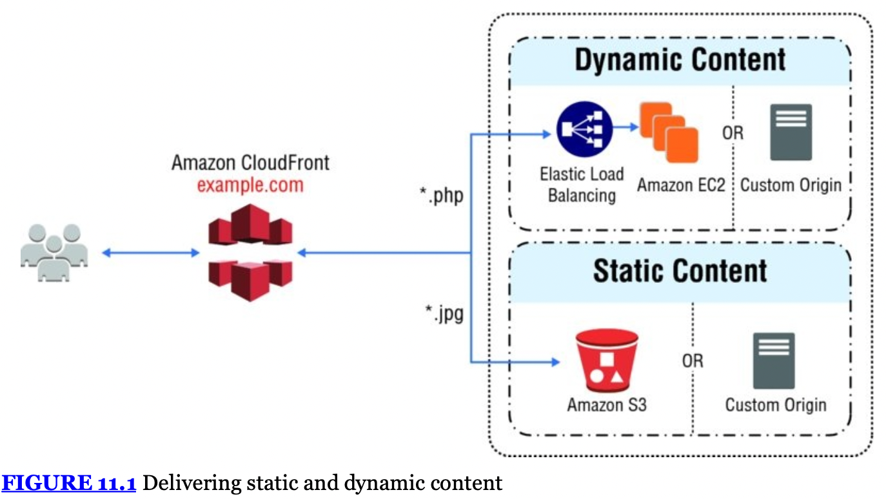

# Chapter 11 - Additional Key Services

- **Amazon CloudFront**
  : global _Content Delivery Network (CDN)_ service
  - low latency, high data transfer speeds, and no minimum usage commitments
  - deliver content using Amazon's global network of edge locations
  - optimized to work with other AWS cloud services
  - supports all content that can be served over `http(s)`
  - Amazon CloudFront supports media streaming, using both `HTTP` and `RTMP`
  - **Distributions**
    : resource identified by a DNS domain name
    - to use _CloudFront_ simply use the distribution DNS name instead of the resource DNS name
    - can create your own `CNAME` _record_ instead
      - CNAME is automatically redirected to your Amazon CloudFront distribution domain name.
  - **Origins**
    : specify the DNS of the origin (where the definitive version lives)
  - **Cache Control**
    : once served from an edge location, objects stay in the cache until they expire
    - default 24hr cache expiry
    - `Cache-Control` headers set by origin server
    - or, set minimum & maximum _TTL_ for objects in your _distribution_
  - can remove objects from edge locations using the _invalidation API_.
    - designed to be used in unexpected circumstances (e.g correcting an error)
  - Use cases:
    - Serving the Static Assets of Popular Websites
    - Serving a Whole Website or Web Application
    - Serving Content to Users Who Are Widely Distributed Geographically
    - Distributing Software or Other Large Files
    - Serving Streaming Media
    - All or Most Requests Come From a Single Location
    - All or Most Requests Come Through a Corporate VPN

- **Content Delivery Network (CDN)**
  : globally distributed network of caching servers that speed up the downloading of web pages and other content
  - use _domain name system (DNS)_ _geo-location_ to determine the geographic location of each request
  - serve content from edge cache servers closest to the location

- **Dynamic Content, Multiple Origins, and Cache Behaviors**
  - cache behavior lets you configure a variety of Amazon CloudFront functionalities for a given URL path pattern for files on your website
  - e.g functionality that can be configured using cache behaviours:
    - path pattern
    - which origin to forward your requests to
    - whether to forward query strings to your origin
    - whether certain paths require signed urls
    - whether to require `https` access
    - amount of time the files stay in the cache
  - cache behaviours are applied in order
  - use case: _Private Content_
    : _CloudFront_ provides several mechanisms that allow you to serve private content (i.e paid users or company network)
    - **signed urls**
      : urls that are only valid for a certain period of time
    - **Signed Cookies**
      : require authentication via private-public key pairs
    - **Origin Access Identities (OAI)**
      : restrict access to an Amazon S3 bucket only to a special Amazon CloudFront user associated with your distribution

