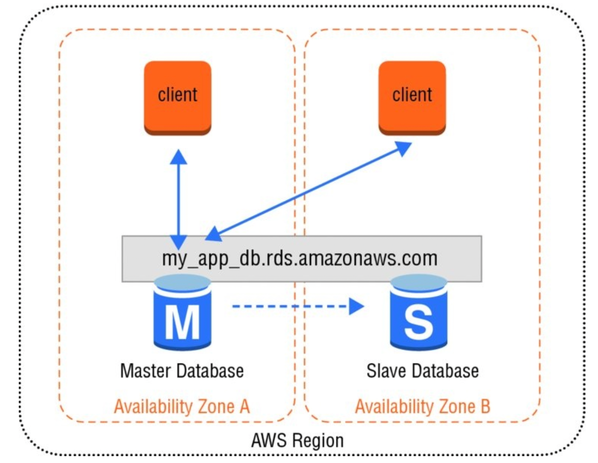
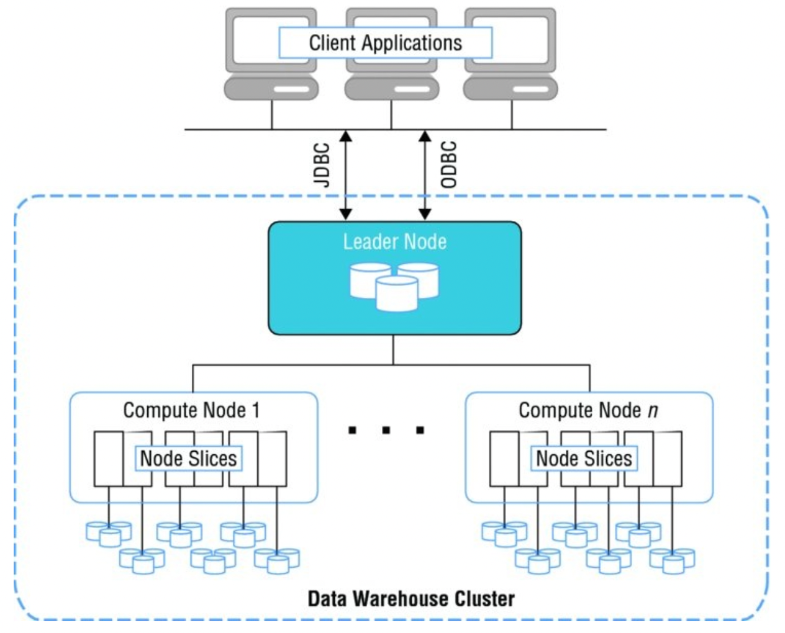

# Chapter 7 - Databases & AWS

- **Relationtional Database**
  : read and write from a database using _Structured Query Language (SQL)_
  - two categories:
    1. _Online Transaction Processing (OLTP)_
    2. _Online Analytical Processing (OLAP)_
  - can have a mix of both categories
  - many organisations split their relational databases into two different databases
    - one database for main transactions (_OLTP transactions_)
    - other database as their data warehouse (_OLAP_)

- **Online Transaction Processing (OLTP)**
  : transaction oriented applications that are frequently writing and changing data
  - _Amazon RDS_ typically used for OLTP transactions (can be used for _OLAP_ aswell)

- **Online Analytical Processing (OLAP)**
  : reporting or analyzing large data sets 
  - _Amazon Redshift_ is designed specifically for _OLAP_ use cases

- **Data Warehouses**
  : a central repository for data that can come from one or more sources
  - specialized type of relational database that can be used for reporting and analysis via _OLAP_
  - typically used to compile reports and search the database using highly complex queries
  - typically updated on a _batch schedule multiple times per day_ instead of "real-time"

- **NoSQL Databases**
  : non-relational and do not have the same table and column semantics
  - often simpler, more flexible and achieve higher performance levels in some cases
  - key/value stores or document stores with flexible schemas
  - _DynamoDB_ is an Amazon offering
  - e.g use cases: managing user sessions state, user profiles, shopping cart data or time-series data

- **Amazon RDS**
  : service that simplifies the setup, operations and scaling of a relational database on AWS
  - streamlines the installation of database software and provisioning of infrastructure capacity
  - _does not_ provide database shell access and restricts access to certain system procedures and tables that require advanced privileges
  - __API__ that lets you create and manage more than one _DB instance_.
    - `CreateDBInstance` vs `ModifyDBInstance`
  - compute and memory resources of a _DB instance_ is determined by its class
  - increases operational reliability by applying a very consistent deployment and operational model
  - Database Engines
    - MySQL
    - PostgreSQL
    - MariaDB
    - Oracle
    - Microsoft SQL Server
  - __License Included__ or __Bring Your Own License (BYOL)__
  - Built using _Elastic Block Store_ (select based on storage need and cost)
    - __Magnetic / Standard Storage__
      - cost effective for applications with light I/O requirements
    - __General Purpose (SSD)__
    - __Provisioned IOPS (SSD)__
      - I/O intensive workloads
  - Automated backups: continuously tracks changes and backs-up your database
  - Manual DB snapshots
  - Recovery:
    - cannot restore to an existing instance from a snapshot (new instance has to be created)
  - Can have multi-availability zone deployments
  - Security includes multi-layers including: infrastructure resources, the database and the network

- **Multi-Availability Zone RDS Architecture**
  : Amazon RDS automatically replicates the data from the master database or primary instance to the slave database or secondary instance using synchronous replication.
  - Amazon RDS detects and automatically detects and recovers from the most common failure scenarious
    - Loss of availability in primary AZ
    - Loss of network connectivity to the primary database
    - Compute unit failure on primary database
    - Storage failure on primary database
 - _Amazon RDS_ will automatically fail over to the standby instance without user intervention. The DNS name remains the same, but the Amazon RDS service changes the `CNAME` to point to the standby.



 - **Amazon RDS Vertical Scalability**
   : adding additional compute, memory or storage resources to a relational database
   - select a different DB instance class

- **Amazon RDS Partitioning**
  - partitioning a large relational database into multiple instances to handle more requests
  - requires additional logic in the application layer
 
- **Amazon RDS Read-Replicas**
  : use read-replicas to offload read transactions from the primary database and increase the overall number of transactions
  - e.g Offload reporting or data warehousing scenarios against a replica instead of the primary DB Instance.

- **Recovery Point Objective (RPO)**
  : maximum period of data loss that is acceptable in the event of a failure or incident

- **Recovery Time Objective (RTO)**
  : maximum amount of downtime that is permitted to recover from backup and to resume processing

- **Amazon Aurora**
  : offers enterprise-grade commercial database technology while offering the simplicity and cost-effecitiveness of an open-source database
  - Fully-managed service that is MySQL-compatible out of the box
  - redesigning the internal components of MySQL to take a more service oriented approach
  - x5 times performance gain
  - create a _DB Cluster_ that consists of a _primary instance_ and many _replica instances_.

- **DB Parameter Group**
  : acts as a container for engine configuration values that can be applied to one or more _DB instances_

- **DB Option Groups**
  : acts as a contaienr for engine features
  - empty by default

- **Amazon RedShift**
  : fast, powerfull, fully-managed, petabyte-scale data warehouse service
  - Relational database designed for _OLAP_ scenarios
  - automatically monitors your nodes and helps to recover from failures
  - Support for 6 different node types
  - support for a wide range of data types
  - compression encoding
    : _Amazon RedShift_ will automatically sample your data and select the best compression scheme for the column
  - Distribution Strategy
    : minimize the impact of the redistribution step by putting the data where it needs to be before the query is performed.
    1. **Even Distribution**
       : data distributed in a uniform fashion
       - default
    2. **Key Distribution**
       : rows are distributed according to the values in one column
    3. **All Distribution**
       : a full copy of the entire table is distributed to every node
       - useful for lookup tables and other large tables not updated frequently
  - can specify one or more columns as sort keys (for range restricted predicates)



- **Cluster**
  : comprised of a leader node and one or more compute nodes
  - compute nodes are transparent to external applications
  - only interact with leader node
  - each cluster contains one or more databases

- **Amazon DynamoDB**
  : fully managed NoSQL database service that provides fast and low-latency performance
  - consistent high levels of performance, simplify scalability tasks, and improve reliability with automatic replication 

- **NoSQL Data Model**
  - table requires a primary key and no need to explicitly define field types
  - data stored as key-value pairs
  - e.g
    ```
    {
            Id = 101
            ProductName = "Book 101 Title"
            ISBN = "123–1234567890"
            Authors = [ "Author 1", "Author 2" ] Price = 2.88
            Dimensions = "8.5 x 11.0 x 0.5" PageCount = 500
            InPublication = 1 ProductCategory = "Book"
    }
    ```
 - interact with DB through REST endpoints or AWS SDK

- **Scalar Data Types**
  : represents exactly one value
  - _String_, _Number_, _Binary_, _Boolean_, _Null_

- **Set Data Types**
  : useful to represent a unique list of one or more scalar values
  - _String set_, _Number set_, _Binary set_

- **Document Data Types**
  : useful to represent multiple nested attributes
  - _List_, _map_

- **Partition Key**
  : the _primary key_ is made up of one attribute
  - Amazon _DynamoDB_ builds an unordered hash index on this primary key attribute

- **Partition and Sort Key**
  - _primary key_ is made up of two attributes
    1. _partition key_
    2. _sort key_
  - Each item in the table is uniquely identified by the combination of its partition and sort key values.
  - two items can have the same partition key value, but have different sort key values.

- **Provisioned Capacity**
  : required to provision a certain amount of read, write capacity
  - based on configuration settings, _DynamoDB_ will provision the right amount of infrastructure capacity
  - read: `1 capacity unit = 4kb`
  - write: `1 capacity unit = 1kb`
  - metrics: `ConsumedReadCapacityUnits` and `ConsumedWriteCapacityUnits`
  - If you do exceed your provisioned capacity for a period of time, requests will be _throttled_ and can be retried later
    - `ThrottledRequests` metric can be monitored

- **Secondary Indexes**
  : optionally define one or more secondary indexes on that table
  - lets you query the data in the table using an alternate key
  - **Global Secondary Index**
    : a secondary index with a partition and sort key that can be different from the ones on the table
    - can create and delete at any time
  - **Local Secondary Index**
    : an index that has the same partition key attribute as the primary key of the table
  - allow you to search a large table efficiently and avoid an expensive scan operation
  - _DynamoDB_ updates each secondary index when an item is modified (consume write capacity units)

- **Writing Items**
  - three primary actions: 
    1. `PutItem`
    2. `UpdateItem`
       - provides support for _atomic counters_ (consistent across replications)
    3. `DeleteItem`
  - support conditional expressions that allow you to perform validation before an action is applied

- **Reading Items**
  - item can be retreived via the `GetItem` action or through a _Scan_ / _Query_ operation
  - each call to `GetItem` consumes read capacity units
  - default performs an _eventually consistent read_
    - can specify a _strong consistent read_ instead (additional read capacity units consumed)

- **Eventually Consistent Reads**
  : when you read the data, the response might not reflect the results of a recent write operation
  - response might include stale data

- **Strongly Consistent Reads**
  : a response with the most up-to-data is returned 
  - might be less available in the case of a network delay
  - specified via optional parameteres in your request

- **Batch Operations**
  : operations designed for working with large batches
  - `BatchGetItem`
  - `BatchWriteItem`
  - allows you to minimize the overhead of each individual call

- **Searching Items**
  - _Query_ and _Scan_ can be used to search a table or an index
  - **Query**
    : primary search operation you can use to find items in a table or a secondary index
    - requires a partition key and a distinct value to search
    - limited to 1MB response
  - **Scan**
    : will read every item in a table or secondary index
    - returns all the data attributes for every item in the table
    - limited to 1MB response

- **Scaling and Partition**
  - _DynamoDB_ away most of the complexity
  - can scale _horizontally_ through the use of partitions to meet storage and performance requirements
  - each _partition_ represents a unit of compute and storage capacity 
  - well-designed application will take the partition structure of a table into account to distribute read and write transactions evenly and achieve high transaction rates at low latencies
  - _DynamoDB_ stores items for a single table across multiple partitions
  - single partition can hold about 10GB of data and supports a maximum of 3,000 read capacity units or 1,000 write capacity units
  - To achieve the full amount of request throughput provisioned for a table, keep your workload spread evenly across the partition key values

- **Security**
  : _DynamoDB_ gives you granular control over the access rights of users and administrators
  - integrates with _IAM_ service
  - all operations must first be authenticated as a valid user / session
  - applications need to obtain a set of temporary or permanent access keys
  - support for fine-grained access control (specific items)
    - using IAM policy conditions

- **DynamoDB Streams**
  : list of item modifications in the last 24 hours
  - reading the log of activity changes from the stream, you can build new integrations or support new reporting requirements that weren’t part of the original design
  - each item change is buffered in a time-ordered sequence or stream that can be read by other applications
  - can be _enabled_ or _disabled_

- **Shards**
  : _DynamoDB_ stream record groups
  - acts as a container for multiple stream records
  - contains information for accessing and iterating over records

