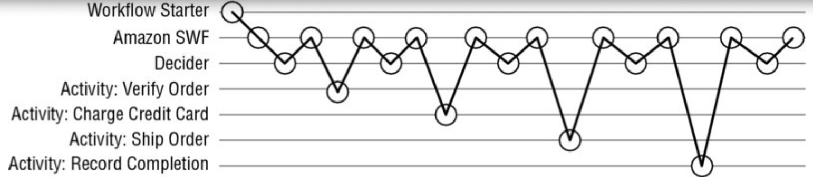

# Chapter 8 - SQS, SWF and SNS

- **Amazon SQS**
  : fast, reliable, scalable and fully managed message queue service
  - decouple components of a cloud application
  - trasmit any volume of data, any level of throughput, without losing messages or requiring other services to be continously available
  - _SQS_ is effectively a __buffer__ between the application components that _receive_ data and those applications that _process_ the data.
  - ensures delivery of each message at least once
    - should design your system to be _indoponent_
  - service does not garuantee _FIFO_ queueing
    - need to add sequencing information to message packets if it is important
  - messages are _identitified_ by a **globally unique ID** 

!][SQS Message Lifecycle](./images/sqs_lifecycle.png)

- **SQS Message Lifecycle**
  1. Component 1 sends Message A to a queue, and the message is redundantly distributed across the Amazon SQS servers.
  2. When Component 2 is ready to process a message, it retrieves messages from the queue, and Message A is returned. While Message A is being processed, it remains in the queue and is not returned to subsequently receive requests for the duration of the visibility timeout.
  3. Component 2 deletes Message A from the queue to prevent the message from being received and processed again after the visibility timeout expires.

- **Delay Queues**
  : allow you to postpone the delivery of new messages in a queue for a specific number of seconds
  - a message in the queue will be invisible to consumers for the duration of the delay period
  - similar to visibility timeouts

- **Visibility Timeouts**
  : hides a message from consumers after a message is retreived from the queue
  - similar to delay queues

- **In-Flight Message**
  : when a message is neither delayed nor in a visibility timeout
  - up to 120,000 messages in flight at any given time

- **Queue Operations**
  1. `CreateQueue`
  2. `ListQueues`
  3. `DeleteQueue`
  4. `SendMessage`
  5. `SendMessageBatch`
  6. `ReceiveMessage`
  7. `DeleteMessage`
  8. `DeleteMessageBatch`
  9. `PurgeQueue`
  10. `ChanceMessageVisibility`
  11. `ChangeMessageVisibilityBatch`
  12. `SetQueueAttributes`
  13. `GetQueueAttributes`
  14. `GetQueueUrl`
  15. `ListDeadLetterSourceQueues`
  16. `AddPermission`
  17. `RemovePermission`

- **Queue and Message Identifiers**
  : amazon SQS uses **three** identifiers
  1. Queue URLs
  2. Message IDs
  3. Receipt handles

- **Message Attributes**
  : allow you to provide structured metadata items
  - up to 10 attributes per message

- **Long Polling**
  - `ReceiveMessage` function queries the Amazon SQS for messages
  - send a `WaitTimeSeconds` argument to `ReceiveMessage` (up to _20 seconds_)

- **Dead Letter Queue**
  : a queue that other queues target to send messages that for some reason could not be successfully processed
  - primary benefit: ability to _sideline_ and _isolate_ the unsuccessfully processed messages.
  - Analyze any messages sent to the dead leter queue to try to determine the cause of failure

- **Access Control**
  - IAM can be used
  - close coordination between accounts may allow these types of actions through the use of IAM roles, but it is frequently infeasible
  - **Amazon SQS Access Control**
   : allows you to assign policies to queues that grant specific interactions to other accounts without that account having to assume IAM roles from your account

- **Amazon Simple Workflow Service (SWF)**
  : stores tasks, assigns them to workers when they are ready and monitors their progress, and maintains their state, including details on their completion
  - makes it easy to build applications that coordinate work across distributed components
  - **Task**
    : represents a logical unit of work that is performed by a component of your application
  - implement _workers_ to perform _tasks_
  - workers can either run on cloud infrastructure or on-premise
  - allows the application to be resilient to failures in individual components

- **Workflows**
  : coordinate and manage the execution of acitivities that cna be run asychronously across multiple computing devices
  - sequential or parallel processing
  - activities = component tasks
  - workflow coordination logic determines the order in which activities are executed

- **Workflow Domains**
  : provide a way of scoping _Amazon SWF_ resources
  - must specify a _domain_ for all the components of a workflow
  - workflows in different domains cannot interact with each other

- **Workflow History**
  : detailed, complete, and consistent record of every event that occured since the workflow execution started
  - an **event** represents a _discrete change_ in your _workflow execution's state_.

- **Actors**
  : a number of different types of programmatic features
  - e.g workflow starters, deciders or activity workers
  - communicate with _Amazon SWF_ through the API
  - develop actors in any programming language

- **Workflow Starter (Actor)**
  : any application that can initiate workflow executions
  - e.g mobile application where a customer orders takeout food or requests a taxi

- **Decider (Actor)**
  : logic that coordinates the tasks in a workflow
  - schedules the activity tasks and provides input data to the activity workers
  - processes events that arrive while the workflow is in progress and closes the workflow when the objective is complete
  - Decides when and if _'activities'_ run sequentially, in parallel, synchronously or asynchronously

- **Activity Worker (Actor)**
  : single computer process (or thread) that performs the activity tasks in you workflow
  - different types of _activity workers_ process tasks of different _activity types_
  - polls Amazon SWF for tasks that are appropriate for that activity worker
 
- **Tasks**
  - Three types of tasks:
    1. Activity Tasks
       : tells an activity worker how to perform it's function 
    2. Lambda Tasks
       - similar to an activity task
    3. Decision Tasks
       : tells a decider the state of the workflow execution has changed
       - AWS SWF schedules a _decision task_ at the start and every time the state changes
       - contains a paginated view of the entire workflow history

- **Task Lists**
  : provide a way of organizing the various tasks associated with a workflow
  - similar to dynamic queues
  - provide a flexible mechanism to route tasks to workers as your use case necessitates

- **Long Polling**
  - _Deciders_ and _activity_ workers communicate with _Amazon SWF_ using **long polling**
  - periodically initiate communication with _SWF_

- **Object Identifiers**
  - _SWF_ objects are uniquely identified by **workflow type**, **activity type**, **decision** and **activity** tasks and **workflow execution**
  - `RegisterWorkflowType`
  - `RegisterActivityType`
  - Each decision task and activity task is identified by a unique task token
  - `PollForDecisionTask`
  - `PollForActivityTask`
  - `StartWorkflowExecution`
    : returns a run ID

- **Workflow Execution Closure**
  - can be closed as one of:
    - completed
    - cancelled
    - failed
    - timed-out
  - can be _continued_ as a new execution or terminated

**Lifecycle of Workflow Execution**

- **Amazon Simple Notification Service (SNS)**
  : web service for mobile and enterprise messaging that enables you to set up, operate, and send notifications
  - **publish-subscribe** message paradigm
  - create a topic and control access to it by defining policies that determine which publishers and subscribers can communicate with the topic and via which technologies
  - Each topic has a unique name that identifies the Amazon SNS endpoint where publishers post messages and subscribers register for notifications

- **Common SNS Scenarios**
  - **Fanout**
    : SNS message is sent to a topic and then replicated and pushed to multiple Amazon SQS queues, HTTP endpoints, or email addresses
    - allows for parallel asynchronous processing
    - additionally could be used to replicate data
  - **Application & System Alerts**
    : SMS and/or email notifications that are triggered by pre-defined thresholds
    - e.g CloudWatch services use SNS
  - **Push Email & Text Messaging**
    : transmit messages to individuals or groups via email and/or SMS
  - **Mobile Push Notifications**
    : send messages directly to mobile applications
    - e.g send message to mobile indicating an update is available

